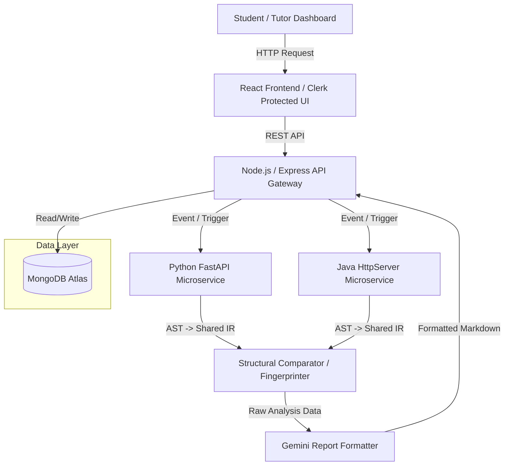

# Multi-Language Code Plagiarism & Logic Contradiction Engine

"An explainable code-analysis platform for detecting structural similarity and simple logical contradictions in Java and Python submissions."

This platform empowers tutors to create programming assessments and allows students to submit Java and Python solutions. Submitted code is transparently analyzed for structural similarity against peers, matched against known-algorithm fingerprints, and checked for simple logical contradictions. The system surfaces supporting structural evidence and generates a human-readable analysis report using an LLM.

**The final academic decision remains strictly with the human tutor.**

---

## Table of Contents

1. [Problem Statement](#2-problem-statement)
2. [Proposed Solution](#3-proposed-solution)
3. [Key Features](#4-key-features)
4. [Supported Languages](#5-supported-languages)
5. [System Architecture](#6-system-architecture)
6. [Technology Stack](#7-technology-stack)
7. [Monorepo Structure](#8-monorepo-structure)
8. [How the Analysis Engine Works](#9-how-the-analysis-engine-works)
9. [LLM Responsibility](#10-llm-responsibility)
10. [User Roles and Permissions](#11-user-roles-and-permissions)
11. [Authentication and Authorization](#12-authentication-and-authorization)
12. [Database Design](#13-database-design)
13. [API Documentation](#14-api-documentation)
14. [Environment Variables](#15-environment-variables)
15. [Installation](#16-installation)
16. [MongoDB Atlas Setup](#17-mongodb-atlas-setup)
17. [Clerk Setup](#18-clerk-setup)
18. [Running the Complete System](#19-running-the-complete-system)
19. [Complete User Flow](#20-complete-user-flow)
20. [Resubmission and Version History](#21-resubmission-and-version-history)
21. [Similarity Graph](#22-similarity-graph)
22. [Example Analysis Scenarios](#23-example-analysis-scenarios)
23. [API and Analysis Failure Handling](#24-api-and-analysis-failure-handling)
24. [Security Considerations](#25-security-considerations)
25. [Limitations](#26-limitations)
26. [Future Improvements](#27-future-improvements)
27. [Development and Testing](#28-development-and-testing)
28. [Demo Flow](#29-demo--hackathon-presentation-flow)
29. [Project Design Principles](#30-project-design-principles)
30. [Why This Architecture?](#31-why-this-architecture)
31. [Performance Considerations](#32-performance-considerations)
32. [Project Status](#33-project-status)
33. [Contribution / Team Structure](#34-contribution--team-structure)
34. [License](#35-license)
35. [Acknowledgements](#36-acknowledgements)
36. [Final Project Summary](#37-final-project-summary)

---

# 2. Problem Statement

Traditional plagiarism checkers often rely heavily on textual or token similarity. Students can bypass these filters by modifying variable names, formatting, comments, or basic control structures while retaining a substantially similar program structure. 

Furthermore:
* Completely different implementations of the exact same well-known algorithm (like Binary Search) can naturally have high similarity, resulting in false positives.
* Logical contradictions inside student code (e.g., dead branches) may be missed by conventional syntax checkers.
* Tutors need an **explainable report** rather than a vague, black-box similarity percentage.
* Students should be able to view the explicit findings affecting their submission for a fair academic process.

*Note: This project does not attempt to solve general program equivalence or detect every sophisticated method of plagiarism.*

---

# 3. Proposed Solution

This platform acts as an orchestrated code analysis pipeline.

**Workflow:**
1. **Student** selects an assessment, chooses Java or Python, and submits code.
2. The **Node Backend** receives the submission and routes it to the language-specific microservice.
3. The **Language Parser** (Python `ast` or JavaParser) converts the code into a normalized, common Intermediate Representation (IR).
4. The system performs **structural comparison** (cross-language capable) against past submissions.
5. The code undergoes **known-algorithm fingerprinting** to identify standard academic algorithms.
6. A **contradiction analysis** evaluates basic logical branching conflicts.
7. The deterministic results (scores, evidence, counts) are passed to the **LLM**, which acts *only as a report formatter*.
8. The human-readable report is stored in **MongoDB**.
9. The **Tutor** reviews the report, similarity graph, and code diff to make a final decision (Clear / Flag / Needs Review / Request Resubmission).
10. The **Student** views their report and the tutor's decision.

**The LLM does not independently decide whether plagiarism occurred.** All findings are calculated by deterministic analysis components.

---

# 4. Key Features

### Authentication
* Clerk authentication ✅ Implemented
* Student and Tutor roles ✅ Implemented
* Role-based route protection ✅ Implemented
* Role selection UI ✅ Implemented
* Clerk webhook synchronization 🚧 In Progress

### Student Features
* Student dashboard ✅ Implemented
* View available assessments ✅ Implemented
* View due dates ✅ Implemented
* Submit Java/Python code ✅ Implemented
* Monaco code editor ✅ Implemented
* Submission status badges ✅ Implemented
* View submitted code ✅ Implemented
* View analysis report ✅ Implemented
* View similarity score & structural evidence ✅ Implemented
* View logic issues & LLM-generated explanation ✅ Implemented
* View tutor note and final tutor decision ✅ Implemented
* Resubmit when requested ✅ Implemented

### Tutor Features
* Tutor dashboard ✅ Implemented
* Create assessments (configure allowed languages) ✅ Implemented
* View submissions table & similarity scores ✅ Implemented
* View contradiction counts ✅ Implemented
* See compared submissions and student identities ✅ Implemented
* Side-by-side code comparison diff viewer ✅ Implemented
* Add tutor notes & final decisions (Clear / Flag / Needs Review) ✅ Implemented
* Request resubmission ✅ Implemented
* Submission history tracking ✅ Implemented
* Interactive similarity network graph ✅ Implemented

### Analysis Features
* Java AST parsing & Python AST parsing ✅ Implemented
* Common IR representation ✅ Implemented
* Cross-language structural comparison ✅ Implemented
* Variable-name-insensitive comparison ✅ Implemented
* Structural evidence generation ✅ Implemented
* Known-algorithm fingerprint matching ✅ Implemented
* Simple contradiction detection (Python) ✅ Implemented
* Partial-analysis handling & graceful degradation ✅ Implemented
* Human-readable report generation (Gemini) ✅ Implemented

---

# 5. Supported Languages

| Language | Status | Parser | Analysis |
|---|---|---|---|
| Java | MVP | JavaParser | Structural parsing/comparison |
| Python | MVP | Python `ast` | Structural parsing/comparison + contradiction detection |
| C++ | 🔮 Future Work | — | Not implemented |
| JavaScript | 🔮 Future Work | — | Not implemented |

*The MVP intentionally focuses on Java and Python as they are the dominant introductory languages in college curriculums.*

---

# 6. System Architecture



**Responsibilities:**
- **Frontend**: Serves the user interfaces, handles state, and interacts with Clerk for auth headers.
- **API Gateway (Backend)**: Core orchestrator. Stores/fetches records to MongoDB and coordinates analysis tasks.
- **Python Service**: Parses Python into IR, evaluates logical contradictions, matches known algorithms, and compares structural IR nodes.
- **Java Service**: Parses Java via JavaParser into the exact same IR format.

---

# 7. Technology Stack

| Layer | Technology | Purpose |
|---|---|---|
| Frontend | React + Vite | User interface |
| Styling | Tailwind CSS (v4) | UI styling |
| Authentication | Clerk | Authentication and role management |
| API Gateway | Node.js + Express | REST API and orchestration |
| Database | MongoDB Atlas | Persistent application data |
| Python Analysis | FastAPI | Python parsing and analysis |
| Python Parser | Python `ast` | Python AST generation |
| Logic Analysis | Custom Rules Engine | Simple logical consistency checking |
| Java Analysis | Java + JavaParser | Java AST parsing |
| Java HTTP Server | `com.sun.net.httpserver` | Lightweight Java service |
| LLM | Gemini | Human-readable report formatting |
| Code Editor | `@monaco-editor/react` | Code submission UI |
| Diff Viewer | `react-diff-viewer-continued` | Code comparison side-by-side |
| Graph | `react-force-graph-2d` | Similarity network visualization |

---

# 8. Monorepo Structure

```text
/
├── frontend/             # React application (Vite)
│   ├── src/              # Components, pages, layouts
│   ├── public/           # Static assets
│   ├── package.json
│   └── postcss.config.js
│
├── backend/              # Node.js Express server
│   ├── models/           # Mongoose schemas (User, Assessment, Submission, Report)
│   ├── routes/           # Express API endpoints
│   ├── lib/              # Structural comparator & LLM formatter logic
│   ├── scripts/          # Database seed scripts
│   └── package.json
│
├── analysis-python/      # Python FastAPI microservice
│   ├── main.py           # AST parsing, contradiction, and fingerprinting
│   └── requirements.txt
│
├── analysis-java/        # Java parsing microservice
│   ├── src/              # HttpServer and JavaParser handlers
│   └── pom.xml           # Maven configuration
│
└── README.md
```

---

# 9. How the Analysis Engine Works

Pipeline flow:
`Source Code` → `Language Parser` → `AST` → `Normalized IR` → `Structural Comparison` → `Algorithm Fingerprint Check` → `Contradiction Check` → `LLM Report Formatting`

## 9.1 Language Parsing
Python submissions use the built-in `ast` module. Java submissions are processed by `JavaParser`. The objective is to extract loops, conditional branches, assignments, returns, and function calls while discarding comments and exact variable names.

## 9.2 Intermediate Representation (IR)
To facilitate cross-language structural comparisons, all languages compile down to a unified JSON schema:

```json
{
  "language": "python",
  "functions": [
    {
      "name": "string",
      "body": [
        {
          "type": "loop",
          "kind": "while",
          "condition": "low <= high",
          "body": []
        }
      ]
    }
  ]
}
```

## 9.3 Structural Similarity
The system recursively walks both IR bodies, comparing node types, loop structures, branching depth, and operator patterns. Variable and function names are intentionally omitted from scoring, meaning identical algorithms written with totally obfuscated variables will yield high similarity scores. Similarity is a structural heuristic, not a formal mathematical equivalence check.

## 9.4 Known Algorithm Fingerprinting
The fingerprint library checks for signatures corresponding to textbook college algorithms (e.g., Binary Search, Iterative Factorial). A high similarity to these fingerprints triggers a disclaimer in the report noting that the similarity is likely benign.

## 9.5 Logic Contradiction Detection
Currently supported on Python submissions, the system evaluates boolean states and basic comparison condition bounds (e.g., `if age >= 18: eligible = True; if age >= 18: eligible = False`). It is intended to catch basic "copy-paste" oversights and logical dead-branches, not complex symbolic verification.

---

# 10. LLM Responsibility

**The LLM is NOT the plagiarism detector.**

The deterministic Node and Python engines calculate the Similarity score, Structural evidence strings, Fingerprint match confidence, Contradictions, and Partial-analysis states. 

The LLM (Google Gemini) receives these pre-computed JSON values and formats them into readable academic reports.

Advantages:
* Drastically reduces hallucinated findings.
* Makes the analysis completely explainable.
* Separates deterministic heavy lifting from natural-language generation.
* Keeps the analysis engine provider-agnostic.

*(If the LLM fails, the Node.js backend safely falls back to a structural templated string to guarantee report delivery).*

---

# 11. User Roles and Permissions

| Feature | Student | Tutor |
|---|---|---|
| Assessment creation | No | Yes |
| View available assessments | Yes | Own assessments |
| Submit code | Yes | No |
| View own submission | Yes | Yes |
| View own report | Yes | Yes |
| View other student identity | No | Yes |
| Make assessment decision | No | Yes |
| Request resubmission | No | Yes |
| View similarity graph | No | Yes |

---

# 12. Authentication and Authorization

This platform utilizes **Clerk** for robust, drop-in authentication.
* **UI flows**: Login, signup, and role selection are handled by Clerk UI components.
* **Protected Routes**: Frontend routes require active Clerk sessions.
* **Backend Security**: API routes parse the incoming Clerk Bearer token and check `publicMetadata.role`. Role authorization is strictly enforced on the server-side, not just hidden on the frontend.

---

# 13. Database Design

MongoDB Atlas serves as the primary data store. 

### User
Tracks `clerkUserId`, `role` (student/tutor), `name`, `email`.

### Assessment
Tracks `title`, `description`, `dueDate`, `allowedLanguages`, `createdBy` (Tutor Ref).

### Submission
Tracks `assessmentId`, `studentId`, `language`, `code`, `status`, `version`, `history` (array of previous codes/versions).

### Report
Tracks `submissionId`, `version`, `similarityScore`, `comparedAgainst` (student identities removed for students), `fingerprintMatch`, `contradictions`, `structuralEvidence`, `llmReportText`, `decision`.

**Relationships**:
```text
User (Tutor)
 │
 └── creates → Assessment
                 │
                 └── receives → Submission (Student)
                                  │
                                  └── generates → Report
```

---

# 14. API Documentation

| Method | Endpoint | Role | Purpose |
|---|---|---|---|
| GET | `/api/assessments` | Authenticated | List available assessments |
| POST | `/api/assessments` | Tutor | Create an assessment |
| GET | `/api/assessments/:id` | Authenticated | Get assessment details |
| POST | `/api/assessments/:id/submissions` | Student | Submit / Resubmit code |
| GET | `/api/assessments/:id/submissions` | Tutor | View all submissions |
| GET | `/api/assessments/:id/submission-count` | Tutor | Count submissions |
| GET | `/api/assessments/:id/graph` | Tutor | Fetch similarity graph |
| GET | `/api/submissions/:id` | Owner/Tutor | Fetch a specific submission |
| GET | `/api/submissions/:id/report` | Owner/Tutor | Fetch the current analysis report |
| PATCH | `/api/reports/:id/decision` | Tutor | Apply decision (Clear/Flag) |
| PATCH | `/api/submissions/:id/request-resubmission`| Tutor | Request student resubmit |

*(Python Analysis Endpoints: `POST /parse`, `POST /compare`, `POST /contradiction-check`)*
*(Java Analysis Endpoints: `POST /parse`)*

---

# 15. Environment Variables

Never commit these to version control. Set these in a local `.env` inside the `backend` and `frontend` folders.

**Frontend (`frontend/.env`)**:
```env
VITE_CLERK_PUBLISHABLE_KEY=pk_test_...
VITE_BACKEND_URL=http://localhost:4000
```

**Backend (`backend/.env`)**:
```env
CLERK_SECRET_KEY=sk_test_...
CLERK_PUBLISHABLE_KEY=pk_test_...
MONGODB_URI=mongodb+srv://...
GEMINI_API_KEY=AIza...
PYTHON_SERVICE_URL=http://localhost:8000
JAVA_SERVICE_URL=http://localhost:8080
```

---

# 16. Installation

**Prerequisites:** Node.js, npm, Python, pip, Java JDK, Maven, MongoDB Atlas, Clerk account.

### Clone repository
```bash
git clone <repository-url>
cd <project-directory>
```

### Frontend
```bash
cd frontend
npm install
npm run dev
```

### Backend
```bash
cd backend
npm install
node index.js
```

### Python service
```bash
cd analysis-python
pip install -r requirements.txt
uvicorn main:app --reload --port 8000
```

### Java service
```bash
cd analysis-java
mvn compile exec:java
```

---

# 17. MongoDB Atlas Setup

1. Create a free MongoDB Atlas cluster.
2. Create a database user with read/write access.
3. Allow Network Access from `0.0.0.0/0` (for local development).
4. Copy the connection string.
5. Populate the `MONGODB_URI` environment variable in the backend.

---

# 18. Clerk Setup

1. Create a Clerk application.
2. Enable Email / Password authentication.
3. Under API Keys, copy the Publishable Key and Secret Key into the environment files.
4. Ensure `publicMetadata.role` is being set on users during sign-up for proper backend authorization.

---

# 19. Running the Complete System

Launch 4 terminal windows and execute the specific start commands:

**Terminal 1 (Frontend):** `cd frontend && npm run dev`
**Terminal 2 (Backend):** `cd backend && node index.js`
**Terminal 3 (Python):** `cd analysis-python && uvicorn main:app --reload --port 8000`
**Terminal 4 (Java):** `cd analysis-java && mvn compile exec:java`

**Health Checks:**
* Frontend → `http://localhost:5173`
* Backend → `http://localhost:4000`
* Python → `http://localhost:8000/docs`
* Java → `http://localhost:8080/parse`

---

# 20. Complete User Flow

### Student Flow
`Sign Up` → `Choose Student Role` → `Student Dashboard` → `Select Assessment` → `Choose Java/Python` → `Paste Code in Monaco Editor` → `Submit` → `Backend Analysis Triggers` → `Report Generated` → `Student Views Report`

### Tutor Flow
`Sign Up` → `Choose Tutor Role` → `Tutor Dashboard` → `Create Assessment` → `Students Submit` → `View Submissions Table` → `Open Student Report` → `Review Evidence & Side-by-Side Code` → `Save Decision (Clear/Flag)`

---

# 21. Resubmission and Version History

If a submission requires work, tutors can click **Request Resubmission**. 
1. The student dashboard flashes a *"Needs your resubmission"* badge and unlocks the code editor.
2. When the student submits anew, the previous attempt is archived securely into the `history` array.
3. The submission version increments.
4. A brand new `Report` (tagged with the new version) is generated.
5. Tutors can expand a collapsible "Submission History" window to view historical read-only snapshots of the student's iterative progress.

---

# 22. Similarity Graph

The Tutor dashboard offers a Force-Directed 2D Similarity Graph visualization.
* **Nodes** represent individual student submissions (color-coded by decision state: Clear, Flagged, Needs Review).
* **Edges** represent high structural similarity connections between submissions (lines thicken based on similarity score).
* Tutors can intuitively click nodes directly inside the graph canvas to jump instantly to that specific student's analysis report.

---

# 23. Example Analysis Scenarios

**Scenario 1 — Same Known Algorithm**
Student A writes a standard Binary Search. Student B writes the same algorithm but changes every variable to completely irrelevant names. 
*Result:* Structural similarity scores high. Fingerprint identifies the standard algorithm. Report correctly advises the tutor that similarity here is statistically normal for this assignment constraints.

**Scenario 2 — Structural Similarity**
Two students independently submit a massive, convoluted nested `for`-loop sorting block that exactly matches control flow patterns, variable assignments, and operator bounds, despite variable renaming.
*Result:* High structural similarity score without a fingerprint hit. Structural evidence lists identical block patterns.

**Scenario 3 — Logical Contradiction**
A student writes `if (score >= 90): grade = "A"` and further down accidentally writes `if (score >= 90): grade = "F"`.
*Result:* Python engine evaluates the branching rules and flags the explicit boolean state overwrite, passing the contradiction explanation to the LLM.

---

# 24. API and Analysis Failure Handling

**Graceful Degradation (`partial: true`)**
If the Python or Java microservice crashes or hangs, the submission workflow does not permanently freeze. Unreachable services trigger a timeout, failing pairwise comparisons are bypassed, and the MongoDB Report is marked as `partial`. The user is visually informed that their analysis completed in a degraded state, preserving any valid results that successfully processed.

---

# 25. Security Considerations

* **Auth**: Full Clerk JWT enforcement on backend endpoints.
* **Privacy**: Students viewing their own structural comparison reports see "Compared Against Student X" rather than exposing peers' PII.
* **Limits**: Hard 20,000-character code submission limits to prevent AST parser resource exhaustion.
* **Stateless ASTs**: The parsers perform static AST construction; they *do not execute, `eval`, or sandbox* untrusted student code dynamically.

---

# 26. Limitations

* **Supported Languages**: Only Java and Python are supported in the MVP.
* **Not Proving Guilt**: The system operates purely on heuristic structural similarities. It does not prove plagiarism.
* **Logic Checking Limit**: Contradiction detection supports only a limited set of simple comparison cases, and currently runs only on Python submissions.
* **Execution**: Dynamic execution and sandboxed unit testing is not part of the current architecture.
* **LLM Availability**: Explanatory report formatting depends on Gemini API uptime and rate limits.

---

# 27. Future Improvements

* 🔮 **C++ & JavaScript/TypeScript** support.
* 🔮 **Java Contradiction Analysis** translation.
* 🔮 **Runtime Sandboxing** execution for automated test casing.
* 🔮 **Data-Flow Analysis** and Program Dependency Graphs for catching deep code clone obfuscation.
* 🔮 **Exportable PDF Reports** for academic dispute records.
* 🔮 **Redis / Background Jobs** for scaling the analysis pipeline via robust queuing.

---

# 28. Development and Testing

A `seed.js` script is provided inside `backend/scripts/` to rapidly scaffold local databases with dummy Student/Tutor users, mocked assessments, and seeded Java/Python submissions encompassing contradiction loops to test the pipeline natively.
To execute: `node backend/scripts/seed.js`

---

# 29. Demo / Hackathon Presentation Flow

1. Login as Tutor.
2. Create assessment.
3. Login as Student, submit Python logic contradiction code.
4. Show real-time analysis pipeline (terminal logs).
5. Open Student Dashboard, view LLM explanation of the logic contradiction.
6. Login as Tutor, show submissions table.
7. Open report, showcase side-by-side Diff Viewer.
8. Show the Similarity Graph and click on a node.
9. Request Resubmission.
10. Login as Student, show unlocked editor and fix code.

---

# 30. Project Design Principles

* **Explainability:** Evidence and node-tracking matter more than arbitrary % numbers.
* **Human-in-the-loop:** The LLM assists; tutors dictate consequences.
* **Language Independence:** Microservices abstract Java/Python into unified JSON objects.
* **Graceful Degradation:** A broken Python node shouldn't halt the Java student submissions.
* **Separation of Concerns:** NLP generation is kept entirely decoupled from structural tree parsing.

---

# 31. Why This Architecture?

We utilized **React & Node.js** to rapidly prototype a responsive, non-blocking asynchronous UI workflow. **Python FastAPI** was chosen specifically because Python's built-in `ast` and `sympy` modules offer best-in-class syntax introspection and math simplification. **Java HttpServer** was spun up exclusively to leverage the native `JavaParser` library, which is vastly superior at generating Java ASTs than trying to port grammar parsers into Node.

---

# 32. Performance Considerations

Pairwise comparison is an $O(N^2)$ problem relative to class size. To mitigate this, comparisons are restricted only to the subset of peers sharing the exact same Assessment ID. Deterministic JSON AST traversals are extremely lightweight. The similarity graph queries pre-calculated MongoDB similarity scores rather than re-computing edges live on render.

---

# 33. Project Status

| Component | Status |
|---|---|
| Frontend / UI Dashboards | ✅ Implemented |
| Clerk authentication & role routing | ✅ Implemented |
| Student / Tutor submission workflows | ✅ Implemented |
| Python Parser / Contradictions | ✅ Implemented |
| Java Parser | ✅ Implemented |
| Structural Comparator Engine | ✅ Implemented |
| Fingerprint Engine | ✅ Implemented |
| LLM Gemini Report Builder | ✅ Implemented |
| Similarity Network Graph | ✅ Implemented |
| Resubmission / History Pipeline | ✅ Implemented |
| Automated Code Execution/Unit Testing | 🔮 Future Work |

---

# 34. Contribution / Team Structure

Recommended distribution for a hackathon:
* **Frontend & UX**: Design, Clerk integration, React Force Graphs, Tailwind polish.
* **Backend & API**: Express controllers, MongoDB schema design, event orchestration.
* **Analysis Engine**: AST traversal logic, Python logic mapping, prompt engineering the LLM formatter.

---

# 35. License

License: Not specified yet.

---

# 36. Acknowledgements

This architecture heavily leverages:
* **React, Node.js, Express, MongoDB**
* **FastAPI, JavaParser, SymPy**
* **Clerk Auth**
* **Monaco Editor** & **React Diff Viewer**
* **Google Gemini LLM API**

---

# 37. Final Project Summary

The **Multi-Language Code Plagiarism & Logic Contradiction Engine** orchestrates role-based assessment management, multi-language semantic parsing, and structural code similarity into a unified platform. By integrating known-algorithm awareness and basic logic contradiction tracing alongside human-readable LLM reports, it serves as an advanced, transparent academic review tool that empowers tutors to make informed, fair decisions.
